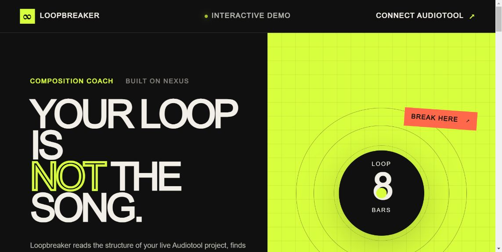
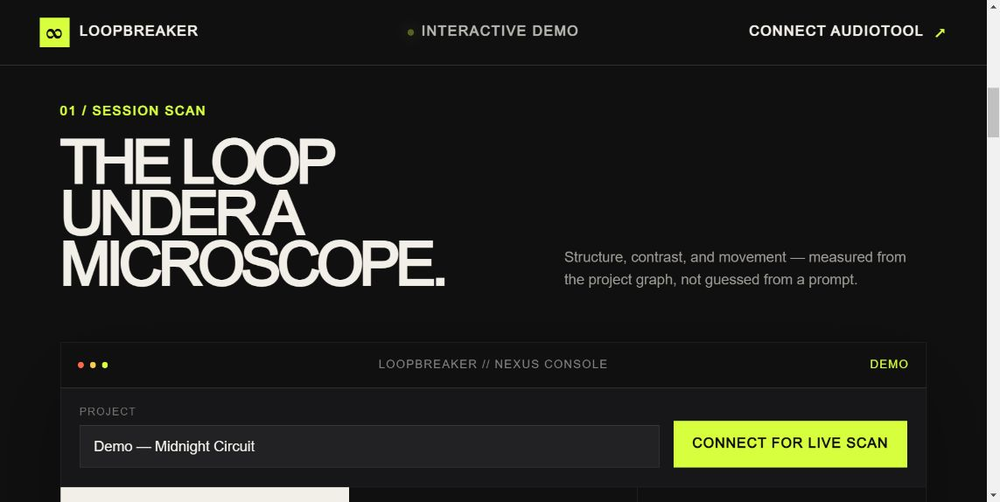
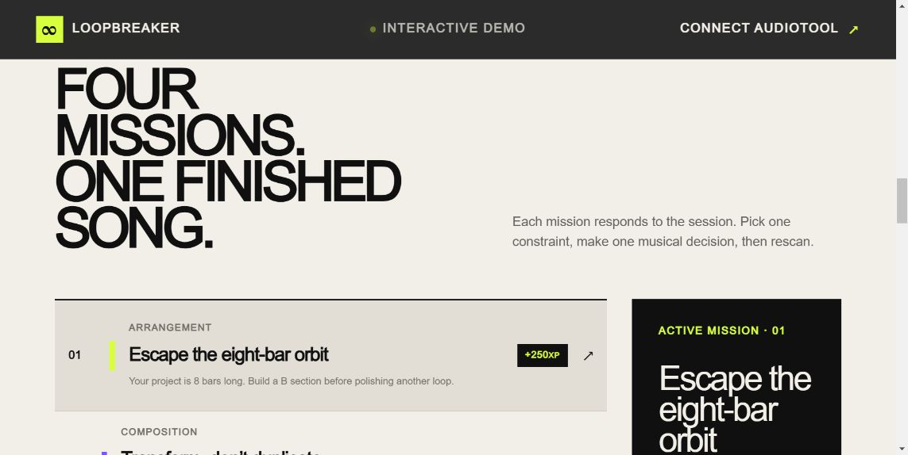
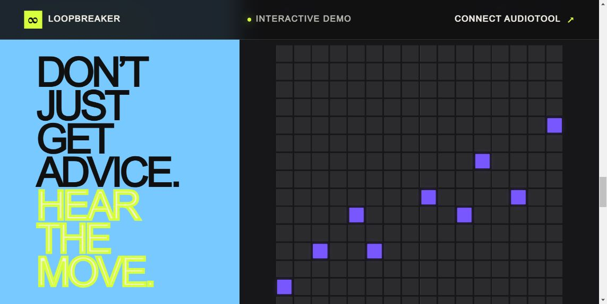

# Loopbreaker Quest

[](https://github.com/ceodaradigu/loopbreaker-quest/actions/workflows/verify.yml)

> Your loop is not the song.

Loopbreaker is a live composition coach for Audiotool. It reads a project through Nexus, detects where musical momentum is stalling, and turns the next move into a focused mission. When the artist wants a concrete starting point, it can add a new Tonematrix variation without changing or deleting existing music.

Built for **Audiotool Let’s Build! 2026**. Primary category: **Composition**. Secondary category: **Music Games**.

## The problem

Starting a loop is easy. Deciding what the song needs next is not. Producers often polish the same eight bars because generic advice such as “add variation” does not connect to the actual session.

Loopbreaker closes that gap:

1. **Scan** the live project graph.
2. **Measure** arrangement length, pitch palette, development, active roles, dynamics, and tempo.
3. **Choose** one context-aware mission instead of receiving a long checklist.
4. **Build** the move manually or add one safe Tonematrix variation.
5. **Rescan** as the song develops, including collaborative edits.

## What works

- Interactive demo with a complete example session and audible Web Audio previews; no account or paid API required.
- Audiotool browser OAuth using the minimal `project:write` scope.
- Live project picker and Nexus document synchronization.
- Deterministic analysis of notes, note regions, patterns, instruments, effects, duration, tempo, pitch classes, and velocity spread.
- Four adaptive mission families: arrangement, motif, sonic role, and pulse.
- Three deterministic 16-step Tonematrix strategies: call-and-response, register lift, and negative space.
- Explicit, non-destructive write: creates a named Tonematrix and pattern only after the user clicks, then connects it to a free mixer input. If no free input exists, it creates one empty mixer channel before adding the cable.
- Responsive, keyboard-accessible product surface with reduced-motion support.

## Nexus integration

Loopbreaker uses `@audiotool/nexus` `0.0.17`.

```text
Audiotool OAuth
      ↓
projects.listProjects()
      ↓
client.open(project) → document.start()
      ↓
queryEntities(notes, regions, patterns, devices, config)
      ↓
deterministic score + four missions
      ↓ explicit user action
document.modify() → Tonematrix + pattern + free mixer input + cable
```

The live write is intentionally additive. The code contains no entity deletion path, does not mutate the artist’s existing devices, and does not send project contents to a third-party model.

## Local setup

Requirements: Node.js 22.13+ and npm.

```bash
npm install
npm run dev
```

To preview the exact production build without a platform-specific runtime:

```bash
npm run build
npm run preview
```

The demo runs without configuration. For the live Nexus flow, register the deployed redirect URL and `http://127.0.0.1:4173/` in Audiotool Developer Hub, then create `.env.local`:

```bash
NEXT_PUBLIC_AUDIOTOOL_CLIENT_ID=your_public_client_id
```

The client ID is an OAuth public identifier, not a secret. Never add access tokens or credentials to the repository.

For local OAuth, build after setting the client ID and use the registered preview origin exactly:

```bash
npm run build
npm run preview
```

Open `http://127.0.0.1:4173/`. The ordinary development server may choose a different port and is intended for the account-free demo unless its exact redirect is registered first.

## Verification

```bash
npm test
npm run typecheck
npm run lint
```

The current automated checks verify server rendering, the explicit/non-destructive Nexus write contract, and all three variation paths. A live write still requires an Audiotool project and a registered OAuth redirect.

## Demo flow (2–5 minutes)

1. Open the demo and introduce the eight-bar-loop problem.
2. Show the session scan and explain the momentum score.
3. Switch among the four missions and show how their wording responds to project evidence.
4. Play all three Tonematrix strategies directly in the browser.
5. Connect Audiotool, scan a live project, and forge one variation.
6. Return to Audiotool and show the newly named device, pattern, and connection beside untouched existing music.

The timed narration and shot list are in [`DEMO_SCRIPT.md`](./DEMO_SCRIPT.md).

## Screenshots









## Design choices and limits

- The score is a transparent coaching heuristic, not a claim about musical quality.
- Generated notes use a fixed C-pentatonic map so the demo is reproducible. A future version can infer tonal center and remap the same strategies.
- The live path depends on Audiotool Nexus availability and a valid client ID.
- Loopbreaker gives constraints and starting material; authorship stays with the producer.

## AI assistance disclosure

OpenAI Codex assisted with implementation, code review, testing, and documentation. The deterministic analysis and variation logic run locally in the app; Loopbreaker sends no project content to an AI model or other third-party model service at runtime. The published claims, source, tests, and live integration evidence are reviewed before submission.

## Technology

React 19, TypeScript 5.9, vinext/Vite, Cloudflare Workers, and Audiotool Nexus. No database, paid AI service, analytics SDK, or user-content storage.

## License

The submission source is provided for hackathon evaluation. Third-party packages retain their respective licenses; `@audiotool/nexus` is MIT licensed.
